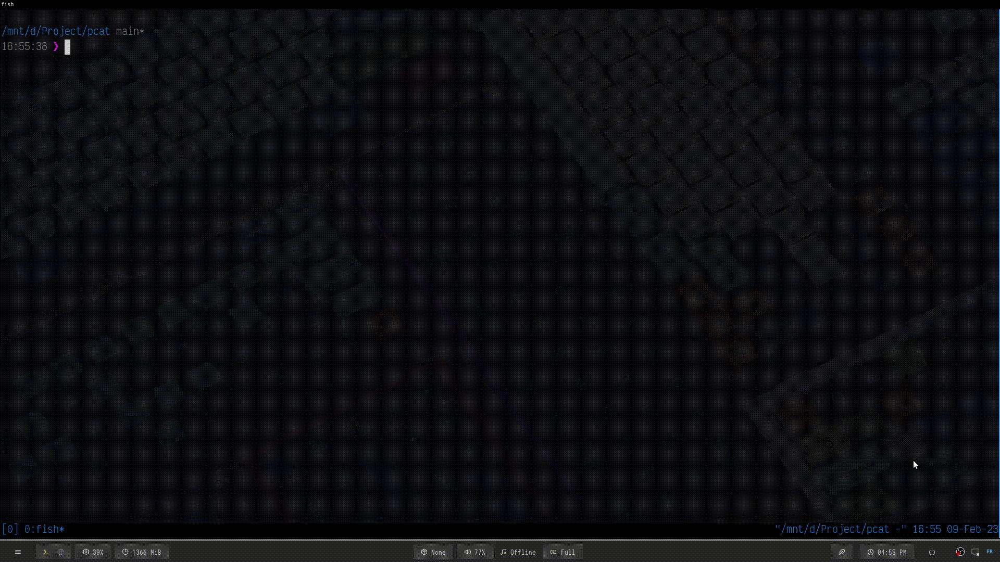

# PCAT

### about
pcat is cat alternative for colored python code

### installation
```bash
git clone https://github.com/j03-dev/pcat
cd pcat
python -m pip install colorama
chmod +x pcat.py
sudo ln -s ./pcat.py /bin/pcat
```


